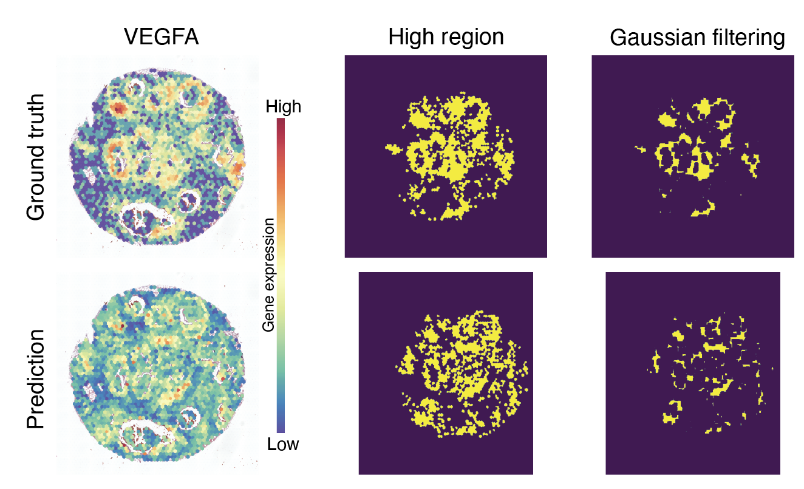
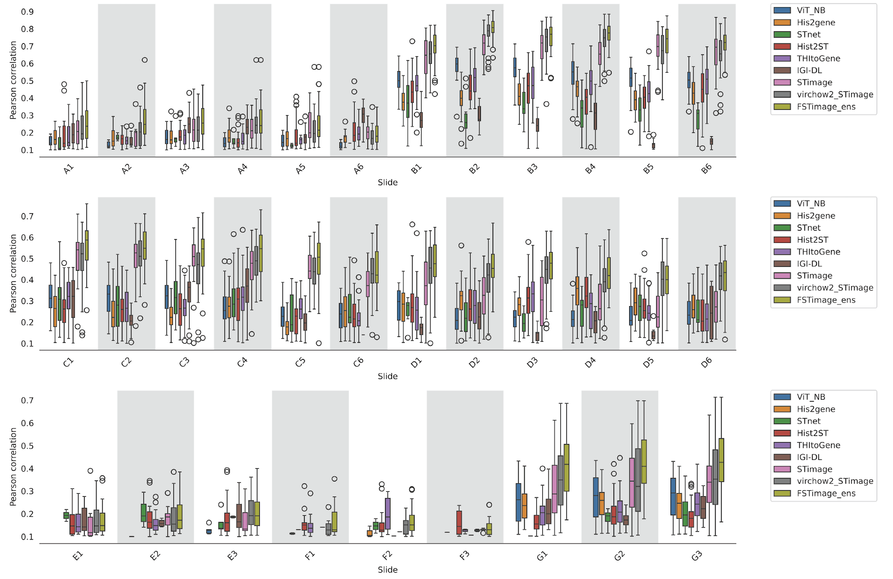
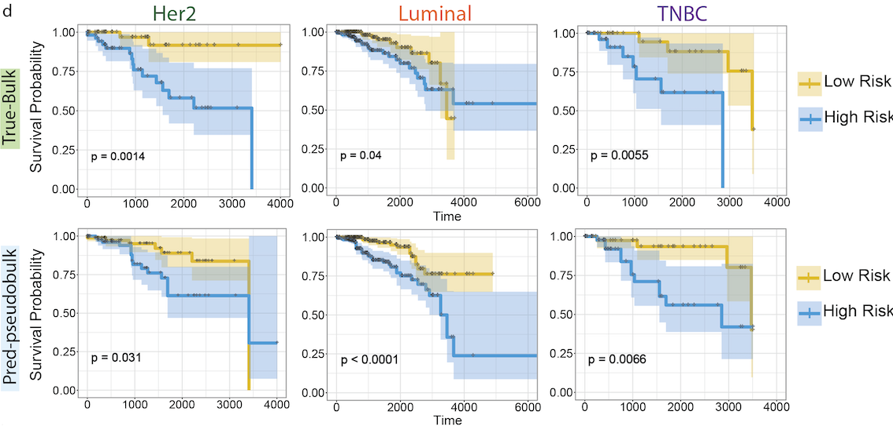
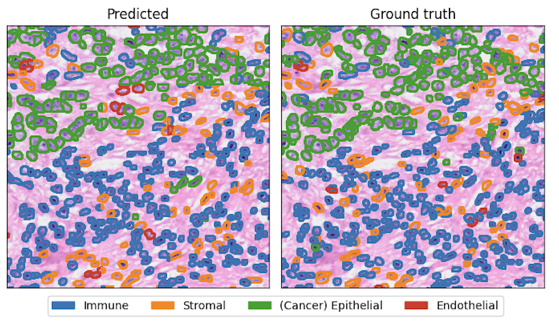
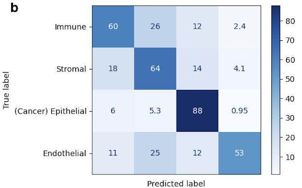

## STimage: using small spatial datasets to train robust prediction models of cancer and immune genes from histopathological images

STimage - *I*nterpretable *M*achine learning *A*pplication for *G*ene *E*xpression prediction using Spatial Transcriptomics data


## Description

Spatial transcriptomic (ST) imaging and sequencing data enable us to link tissue morphological features with thousands
of previously unseen gene expression values, opening a new horizon for understanding tissue biology and achieving
breakthroughs in digital pathology. Deep learning models are emerging to predict gene expression or classify cell types
using images as the sole input. Such models hold significant potential for clinical applications, but require improvements
in interpretability and robustness. We developed STimage as a comprehensive suite of models for both regression
(predicting gene expression) and classification (mapping tissue regions and cell types) tasks. STimage is the first to
thoroughly address robustness (uncertainty) and interpretability. For robustness, STimage predicts gene expression based
on parameter distributions rather than fixed data points, allowing for generalisation at a population scale. STimage
estimates uncertainty from the data (aleatoric) and from the model (epistemic) for each of thousands of imaging
tiles. STimage achieves interpretability by analysing model attribution at a single-cell level, and in the context of
histopathological annotation. While existing models focus on predicting highly variable genes, STimage predicts functional
genes and identifies highly predictable genes. Using diverse datasets from three cancers and one chronic disease, we
assessed the model’s performance on in-distribution and out-of-distribution samples. STimage is robust to technical
variations across platforms, data types, sample preservation methods, and disease types. Further, we implemented an
ensemble approach, incorporating pre-trained foundation models, to improve performance and reliability, especially in
cases with small training datasets. With single-cell resolution Xenium data, STimage could classify cell types for millions
of individual cells. Applying STimage to proteomics data such as CODEX, we found that STimage can predict gene
expression consistent with protein expression patterns. Finally, we showed that using STimage-predicted values based
solely on imaging input, we could stratify patient survival groups. Overall, STimage advances spatial transcriptomics
by improving the prediction of gene expression from traditional histopathological images, making it more accessible for
tissue biology research and digital pathology applications.

## Installation

### Create conda environment

```bash
conda create -n stimage python=3.8 python-spams
```

### Install stimage

```bash
git clone https://github.com/BiomedicalMachineLearning/STimage.git
cd STimage
pip install -e .
```
## Usage

### Data 
an example of dataset meta data
```bash
$ cat metadata.csv
,sample,count_matrix,spot_coordinates,histology_image
0,BC23287_C1,/clusterdata/uqxtan9/Xiao/STimage/dataset/breast_cancer_oldST_STNet/stdata/BC23287_C1_stdata.tsv,/clusterdata/uqxtan9/Xiao/STimage/dataset/breast_cancer_oldST_STNet/spotinfo/spots_BT23287_C1.csv,/clusterdata/uqxtan9/Xiao/STimage/dataset/breast_cancer_oldST_STNet/HEimage/HE_BT23287_C1.jpg
1,BC23287_C2,/clusterdata/uqxtan9/Xiao/STimage/dataset/breast_cancer_oldST_STNet/stdata/BC23287_C2_stdata.tsv,/clusterdata/uqxtan9/Xiao/STimage/dataset/breast_cancer_oldST_STNet/spotinfo/spots_BT23287_C2.csv,/clusterdata/uqxtan9/Xiao/STimage/dataset/breast_cancer_oldST_STNet/HEimage/HE_BT23287_C2.jpg
2,BC23287_D1,/clusterdata/uqxtan9/Xiao/STimage/dataset/breast_cancer_oldST_STNet/stdata/BC23287_D1_stdata.tsv,/clusterdata/uqxtan9/Xiao/STimage/dataset/breast_cancer_oldST_STNet/spotinfo/spots_BT23287_D1.csv,/clusterdata/uqxtan9/Xiao/STimage/dataset/breast_cancer_oldST_STNet/HEimage/HE_BT23287_D1.jpg
3,BC23450_D2,/clusterdata/uqxtan9/Xiao/STimage/dataset/breast_cancer_oldST_STNet/stdata/BC23450_D2_stdata.tsv,/clusterdata/uqxtan9/Xiao/STimage/dataset/breast_cancer_oldST_STNet/spotinfo/spots_BT23450_D2.csv,/clusterdata/uqxtan9/Xiao/STimage/dataset/breast_cancer_oldST_STNet/HEimage/HE_BT23450_D2.jpg
4,BC23450_E1,/clusterdata/uqxtan9/Xiao/STimage/dataset/breast_cancer_oldST_STNet/stdata/BC23450_E1_stdata.tsv,/clusterdata/uqxtan9/Xiao/STimage/dataset/breast_cancer_oldST_STNet/spotinfo/spots_BT23450_E1.csv,/clusterdata/uqxtan9/Xiao/STimage/dataset/breast_cancer_oldST_STNet/HEimage/HE_BT23450_E1.jpg
```

### Configuring

Parameters are specified in a configuration file. 
An example `example.ini` file are shown:

```ini
[PATH]
METADATA_PATH = /clusterdata/uqxtan9/Xiao/STimage/dataset/breast_cancer_oldST_STNet/dataset.csv
DATA_PATH = /clusterdata/uqxtan9/Xiao/STimage/dataset/breast_cancer_oldST_STNet
TILING_PATH = /clusterdata/uqxtan9/Xiao/STimage/dataset/breast_cancer_oldST_STNet/tiles
OUT_PATH = /clusterdata/uqxtan9/Xiao/STimage/development/Wiener/test_results

[DATASET]
# Visium or Legacy_ST
platform = Visium
normalization = log
ensembl_to_id = True
gene_selection  = tumour
training_ratio = 0.7
valid_ratio = 0.2

[TRAINING]
batch_size = 64
early_stop = True
epochs = 10
model_name = NB_regression

[RESULTS]
save_train_history = True
save_model_weights = True
correlation_plot = True
spatial_expression_plot = True

```

### 1. Preprocessing

```bash
stimage/01_Preprocessing.py --config /PATH/TO/config_file.ini
```

### 2. Model Training

```bash
stimage/02_Training.py --config /PATH/TO/config_file.ini
```

### 3. Model Prediction

```bash
stimage/03_Prediction.py --config /PATH/TO/config_file.ini
```

### 4. Interpretation

```bash
stimage/04_Interpretation.py --config /PATH/TO/config_file.ini
```

### 5. Visualisation

```bash
stimage/05_Visualisation.py --config /PATH/TO/config_file.ini
```


## Results

### Model prediction
Observed expression of gene *TTLL12* | Predicted  expression of gene *TTLL12*
:-----------------------------------:|:--------------------------------------: 
              | 

### Pattern matrix


### Benchmark


### LIME interpretation


### TCGA survival analysis


### Single cell cell type prediction
cell type spatial plot | confusion matrix
:-----------------------------------:|:--------------------------------------: 
 | 

### interactive webtool

This [interactive webtool](https://gml-stimage-web-app.streamlit.app/) will allow you to upload your own image to predict the gene expression and visualize the model performance and interpretation. 

## Citing STimage

## The Team
Please contact Dr Quan Nguyen (quan.nguyen@uq.edu.au), 
Xiao Tan (xiao.tan@uq.edu.au) and Onkar Mulay (o.mulay@uq.net.au) for issues, suggestions, 
and we are very welcome to collaboration opportunities.
