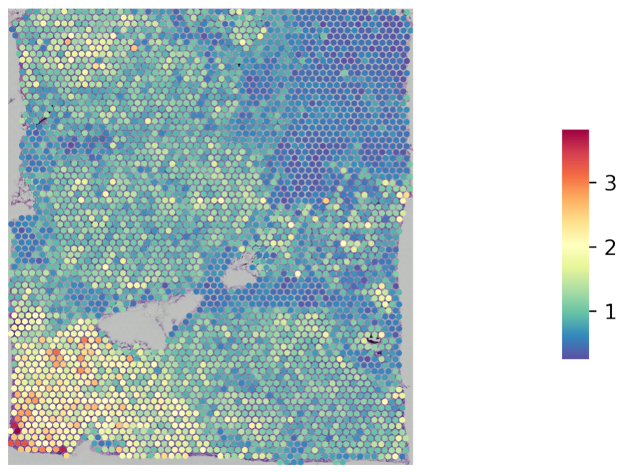

# STimage - *I*nterpretable *M*achine learning *A*pplication for *G*ene *E*xpression prediction using Spatial Transcriptomics data


## Description


## Installation

## Usage

### Data 
an example of dataset meta data
```bash
$ cat metadata.csv
,sample,count_matrix,spot_coordinates,histology_image
0,BC23287_C1,/clusterdata/uqxtan9/Xiao/STimage/dataset/breast_cancer_oldST_STNet/stdata/BC23287_C1_stdata.tsv,/clusterdata/uqxtan9/Xiao/STimage/dataset/breast_cancer_oldST_STNet/spotinfo/spots_BT23287_C1.csv,/clusterdata/uqxtan9/Xiao/STimage/dataset/breast_cancer_oldST_STNet/HEimage/HE_BT23287_C1.jpg
1,BC23287_C2,/clusterdata/uqxtan9/Xiao/STimage/dataset/breast_cancer_oldST_STNet/stdata/BC23287_C2_stdata.tsv,/clusterdata/uqxtan9/Xiao/STimage/dataset/breast_cancer_oldST_STNet/spotinfo/spots_BT23287_C2.csv,/clusterdata/uqxtan9/Xiao/STimage/dataset/breast_cancer_oldST_STNet/HEimage/HE_BT23287_C2.jpg
2,BC23287_D1,/clusterdata/uqxtan9/Xiao/STimage/dataset/breast_cancer_oldST_STNet/stdata/BC23287_D1_stdata.tsv,/clusterdata/uqxtan9/Xiao/STimage/dataset/breast_cancer_oldST_STNet/spotinfo/spots_BT23287_D1.csv,/clusterdata/uqxtan9/Xiao/STimage/dataset/breast_cancer_oldST_STNet/HEimage/HE_BT23287_D1.jpg
3,BC23450_D2,/clusterdata/uqxtan9/Xiao/STimage/dataset/breast_cancer_oldST_STNet/stdata/BC23450_D2_stdata.tsv,/clusterdata/uqxtan9/Xiao/STimage/dataset/breast_cancer_oldST_STNet/spotinfo/spots_BT23450_D2.csv,/clusterdata/uqxtan9/Xiao/STimage/dataset/breast_cancer_oldST_STNet/HEimage/HE_BT23450_D2.jpg
4,BC23450_E1,/clusterdata/uqxtan9/Xiao/STimage/dataset/breast_cancer_oldST_STNet/stdata/BC23450_E1_stdata.tsv,/clusterdata/uqxtan9/Xiao/STimage/dataset/breast_cancer_oldST_STNet/spotinfo/spots_BT23450_E1.csv,/clusterdata/uqxtan9/Xiao/STimage/dataset/breast_cancer_oldST_STNet/HEimage/HE_BT23450_E1.jpg
```

### Configuring

Parameters are specified in a configuration file. 
An example `example.ini` file are shown:

```ini
[PATH]
METADATA_PATH = /clusterdata/uqxtan9/Xiao/STimage/dataset/breast_cancer_oldST_STNet/dataset.csv
DATA_PATH = /clusterdata/uqxtan9/Xiao/STimage/dataset/breast_cancer_oldST_STNet
TILING_PATH = /clusterdata/uqxtan9/Xiao/STimage/dataset/breast_cancer_oldST_STNet/tiles
OUT_PATH = /clusterdata/uqxtan9/Xiao/STimage/development/Wiener/test_results

[DATASET]
# Visium or Legacy_ST
platform = Visium
normalization = log
ensembl_to_id = True
gene_selection  = tumour
training_ratio = 0.7
valid_ratio = 0.2

[TRAINING]
batch_size = 64
early_stop = True
epochs = 10
model_name = NB_regression

[RESULTS]
save_train_history = True
save_model_weights = True
correlation_plot = True
spatial_expression_plot = True

```

### 1. Preprocessing

```bash
stimage/01_Preprocessing.py --config /PATH/TO/config_file.ini
```

### 2. Model Training

```bash
stimage/02_Training.py --config /PATH/TO/config_file.ini
```

### 3. Model Prediction

```bash
stimage/03_Prediction.py --config /PATH/TO/config_file.ini
```

### 4. Interpretation

```bash
stimage/04_Interpretation.py --config /PATH/TO/config_file.ini
```

### 5. Visualisation

```bash
stimage/05_Visualisation.py --config /PATH/TO/config_file.ini
```


## Results

### Model prediction
Observed expression of gene *TTLL12* | Predicted  expression of gene *TTLL12*
:-----------------------------------:|:--------------------------------------: 
              | 

 
### LIME interpretation


### Evaluation --- spatial autocorrelation


## Citing STimage

## The Team
Please contact Dr Quan Nguyen (quan.nguyen@uq.edu.au), 
Xiao Tan (xiao.tan@uq.edu.au) and Onkar Mulay (o.mulay@uq.net.au) for issues, suggestions, 
and we are very welcome to collaboration opportunities.