[TOC]

# Dataset Availability

We have 3 samples from Pfizer. We use 1302A and 1956A as training samples, 4851A as testing sample.

## 1302A

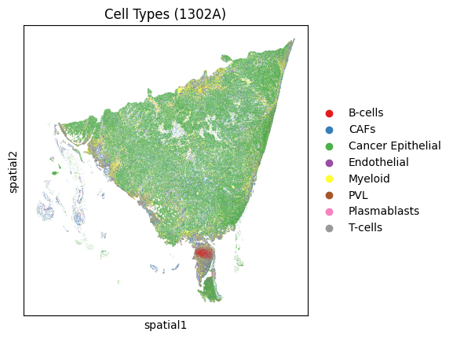

## 1956A 

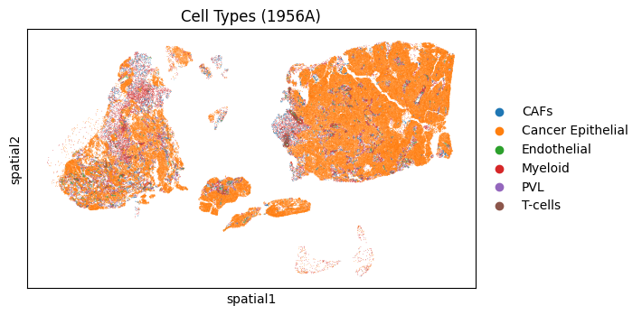

## 4851A

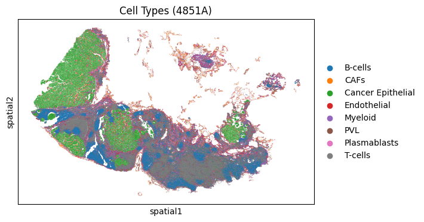

# Exploratory data analysis

* Different views for different crop sizes.

* Cell Type Distribution

* Cell Area Distribution

* Gene Expression Distribution

  

## Different views for different crop sizes.

**Tile size=32**

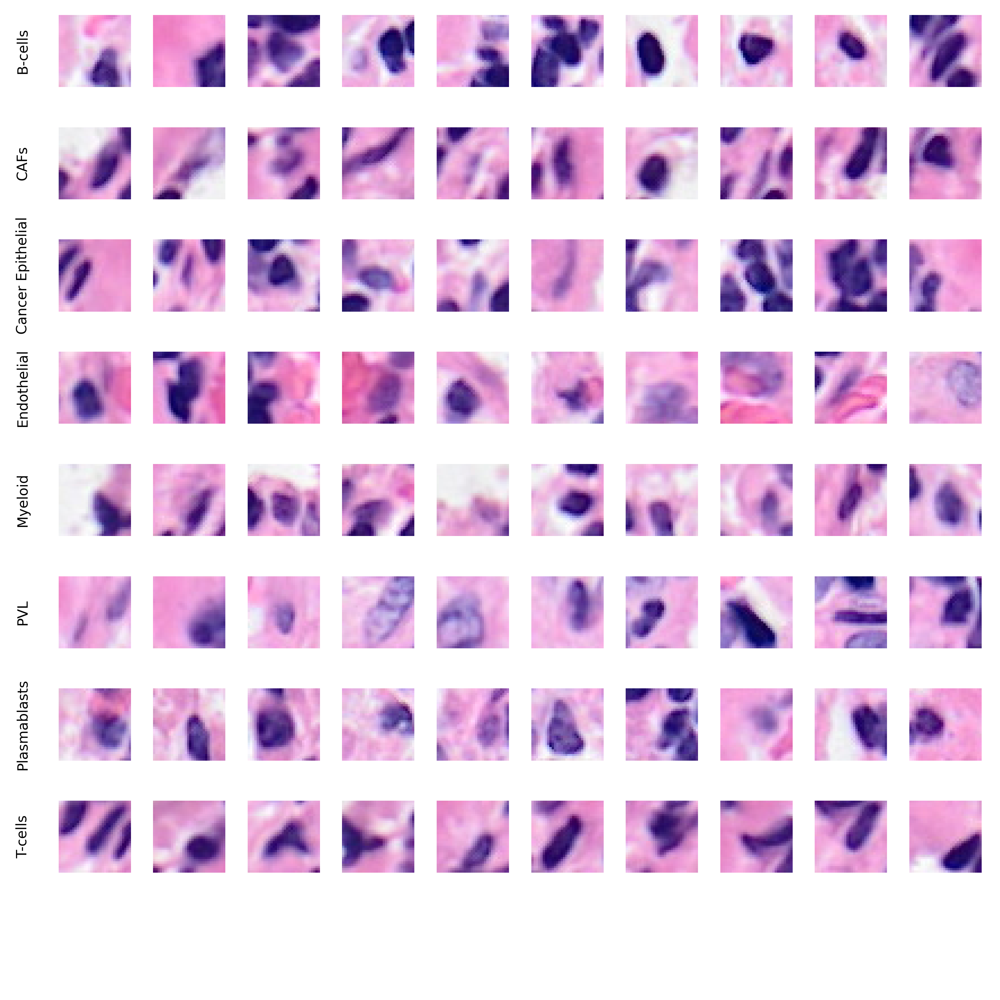

**Tile size=64**

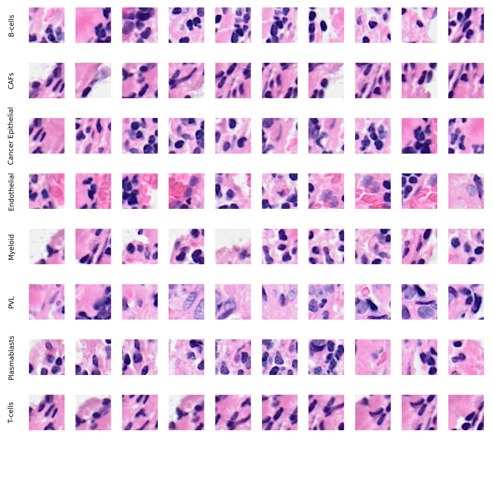

**Tile size=96**

## Cell Type Distribution

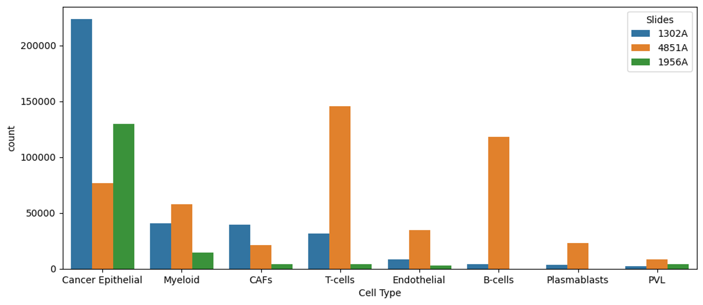

## Cell Area Distribution

### 1302A

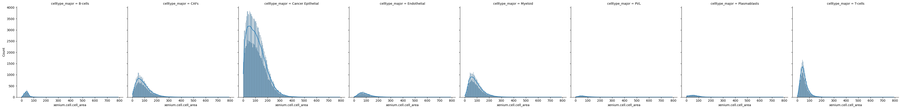

### 1956A

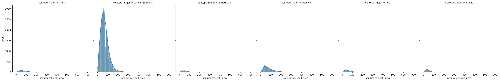

### 4851A

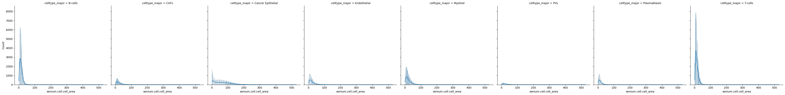

### Statistical Information (Group Analysis)

#### Cell Area by Cell Types across Slides

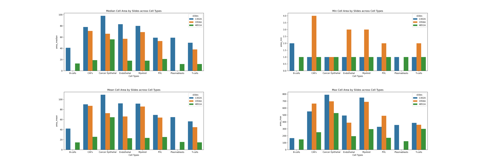

#### Cell Area by Slides across Cell Types 

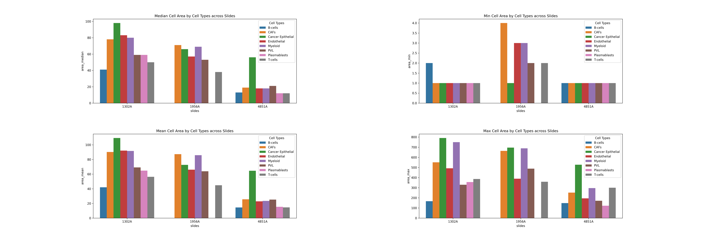

### 

## Gene Expression Distribution

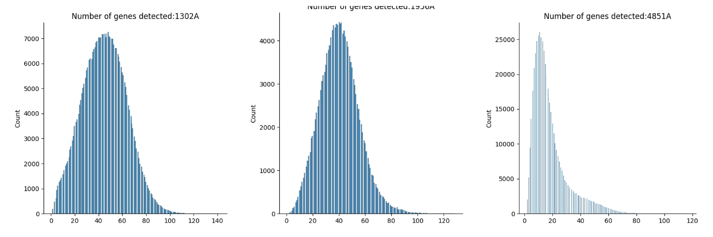

# Dataset Preprocessing

## Remove the tiles with zero or low gene expression values.

Threshold=

|                 | Before | After |
| --------------- | ------ | ----- |
| Number of Tiles |        |       |

## Remove the tiles with the outlier cell area.

Threshold=

|                 | Before | After |
| --------------- | ------ | ----- |
| Number of Tiles |        |       |

## Down-Scaling the dominant cell types & Up-Scaling the minor cell types.

### Original 

|                   | Number of Tiles |
| ----------------- | --------------- |
| CAFs              |                 |
| Cancer Epithelial |                 |
| Endothelial       |                 |
| Myeloid           |                 |
| PVL               |                 |
| Plasmablasts      |                 |
| T-cells           |                 |

### Down scaling dominant cell types

|                   | Number of Tiles |
| ----------------- | --------------- |
| CAFs              |                 |
| Cancer Epithelial |                 |
| Endothelial       |                 |
| Myeloid           |                 |
| PVL               |                 |
| Plasmablasts      |                 |
| T-cells           |                 |

### Up Scaling minor cell types

|                   | Number of Tiles |
| ----------------- | --------------- |
| CAFs              |                 |
| Cancer Epithelial |                 |
| Endothelial       |                 |
| Myeloid           |                 |
| PVL               |                 |
| Plasmablasts      |                 |
| T-cells           |                 |

# Data Augmentation

* Geometric Transformation
* Color Transformation

## Geometric Transformation

### Flipping

### Rotation

## Color Transformation

### Color Augmentation

H&E intensity augmentation

### Color Normalization

Reinhard normalization

# Model

## Baseline

### Resent18

### Resnet50

### Swin-Transformer

## Contrastive Learning (Xenium Dataset)

### CLIP ML Model

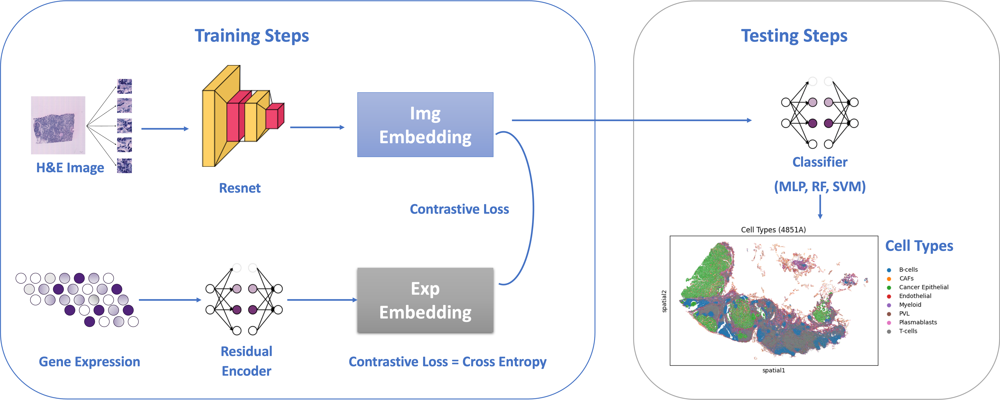

### CLIP FC Model (FineTune Image Encoder)

## Contrastive Learning (Xenium Dataset+SC Dataset)

### CLIP ML Model

Drawbacks:

* Can not finetune image encoder during training machine learning models.
* Sklearn-based machine learning model can not use CUDA to speed up the training process.

### CLIP FC Model (FineTune Image Encoder)

Benefits:

* Contrastive learning can align the latent space between the H&E image and gene expression. Image encoders can learn some features from gene expression.
* Finetuning the image encoder during supervised training can make the image encoder more label-oriented.

## Multi-modal fusion

Feature Fusion Methods:

* Summation

* Concatenation

* Summation Attention

* Concatenation Attention

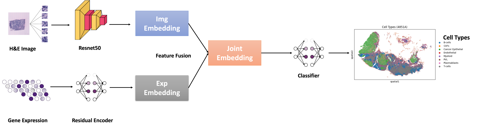

### Summation

### Concatenation

### Summation Attention

### Concatenation Attention

## Deep Kernel Learning

### SVDKL (Stochastic Variational Deep Kernel Learning)

Benefits:

* 

**Pending**

Reference:
https://pyro.ai/examples/dkl.html

https://docs.gpytorch.ai/en/stable/examples/06_PyTorch_NN_Integration_DKL/Deep_Kernel_Learning_DenseNet_CIFAR_Tutorial.html

# Interpretability Assessment

## Integrated Gradients to analyze feature importance

https://captum.ai/tutorials/Resnet_TorchVision_Ablation

**Pending**

# Uncertatinty Assessment

**Pending**
$$
Uncertainty Score = 1 - Prediction Probability
$$
